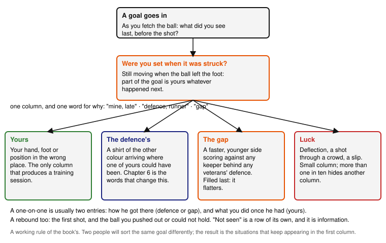

# 1. Review the match

*Which situations should I learn from, and what information am I missing?*

## The situation

The final whistle goes on something like ten–nil. You have picked the ball out of the net more times than you can put in order, the other side averaged thirty-three and yours forty-five, and for most of ninety minutes the ball was in your half. On the walk to the car the goals run together into one feeling, and the feeling says you were terrible. Then a defender says "nothing you could do about most of them", and that feels wrong too. Both are wrong in the same way: a score tells you how many times the ball crossed the line and nothing about what you did. The question this chapter answers is how to turn ten goals into the two or three situations you can actually change, and how to notice what you did not see.

## What you can change and what you cannot

Every goal conceded belongs, mostly, in one of four columns. The sorting is the chapter's whole method, so the columns come first.

**Yours.** A decision or an action that was the keeper's to make and went wrong: a position that left a side of the goal open, a hand that should have held, a run off the line that arrived late or should not have started, a rebound pushed back into the danger.

**The defence's.** A runner nobody tracked, a cross nobody challenged, a ball played in behind a line that had stepped up without looking. You can influence these with your voice, which is chapter 6, but on the day they were not yours.

**The gap.** Goals that a faster, younger side scores against any keeper standing behind any veterans' defence: the striker who is simply past your centre-back after ten metres, the move that goes through four players at a speed the four cannot match. This column exists because it is true, and because pretending the goal was a decision wastes the review. It is also the column that flatters, so it is filled last and only when the other three have been tried.

**Luck.** Deflections, a shot through a crowd you never saw, a slip on wet grass. Small column. If it holds more than one goal in ten, one of the others is hiding in it.

The point of the columns is not blame. It is that only the first one produces a training session, and only the first two produce something to say at the next match. A ten–nil in which seven goals sit in the gap and two with the defence contains one goal to learn from, and finding that one is the review's job.

## The decision: which goals are mine

In the match itself, the decision this chapter asks you to recognise happens in the seconds after each goal, and it is small: **as you fetch the ball, say to yourself which column the goal goes in, and one word for why.** "Mine, late." "Defence, runner." "Gap." Nothing else; the next kick-off is coming. It costs nothing and it is the only reliable record you will have, because memory after the match keeps the feeling and drops the facts. In the book's experience the goals you remember at midnight are the ones that felt worst, which are rarely the ones that were yours.

The cue for the column is what you saw last before the shot. If the last thing you saw was your own hand, foot or position in the wrong place, it is yours. If it was a shirt of the other colour arriving where none of yours was, it is the defence's or the gap's, and the difference is whether one of yours could have been there. If you saw nothing, because the ball came through bodies or off a shin, it is luck, provided you were set. "Provided you were set" is the catch: a keeper still moving when the shot is struck has made the goal partly theirs whatever happened to the ball afterwards, and being set before the shot is chapter 2.

What goes wrong on either side of this decision is the two feelings from the car park. Put every goal in the first column and you will train for ten faults, which means training for none, and you will arrive at the next match already beaten. Put every goal in the gap and there is nothing to train and nothing to say, and the same goals come again. The one-word reason is what keeps you honest, because "gap" needs a reason too, and "they were faster" is only a reason when one of your defenders was actually in a race and lost it.

The two kinds of goal you remember most from the defeat, one-on-ones and close finishes with rebounds, are the two where the columns are hardest to tell apart, and that is not a coincidence. A one-on-one starts as the defence's or the gap's: someone got in behind. It becomes yours at the moment you make a choice, to come or to stay, and at the moment you set your body for the finish. So a one-on-one is usually two entries: how the striker got there, and what you did once they had. The same for a rebound. The first shot is one situation, and the ball you pushed out or could not hold is a second one, yours, whose review question is "where did it go, and where was I when it went there". Chapter 3 is about that second question and chapter 4 about the first, and the log this chapter starts is what tells you which of the two to read first.

## The practice: the review itself

The practice for this chapter is not a drill; it is the review, done in a form that survives contact with a tired man on a Sunday evening. Three forms.

**Alone.** Within a day of the match, before the memory sets, write one line per goal in `matches/`, using the table the folder's README gives: minute if you have it, situation, what you decided, what you would decide now, column. Ten lines, ten minutes. Where you cannot remember a goal at all, write "not seen" in the situation column and leave the rest empty; that row is information, and the next section says what it means. Do not write anything about how you felt. The table has no column for it, on purpose.

**With one teammate.** Ask one defender, ideally the centre-back nearest the goal for most of the match, to go down the same ten goals with you, for five minutes, and to say for each one where the defence was. You are not asking whose fault it was; you are asking what they saw, because they saw the half of the pitch you did not. Their answer decides between the second and third columns better than you can, and it also tells you, for chapter 6, what they expected to hear from you and did not. Write their view in the "what I would decide now" cell, marked with their initial.

**With the squad.** At the one session in the week, take five minutes before the first drill and read out the situations, not the columns: "three balls in behind on the left, two rebounds from shots we let them take from the edge, one corner." No names. A veterans' side will not do a video review and does not need to; it needs to hear that the same three things happened all afternoon, because a defence that knows that trains differently, and a keeper who has said it in front of the squad has already started chapter 6. If the coach or captain wants to pick the session from it, chapter 8 is where that leads.

The squad form adapts nothing from the two FIFA sessions in the book's sources, which train the situations and not the review of them. What it takes from the FA's session on the space in behind is the aim stated on its first line: the relationship between the keeper and the defenders is trained, not assumed, and it starts with both having seen the same goal.

## The observation: what you did not see

The observation to carry into the next match is the empty row. Every "not seen" in your table is a goal about which you have no information, and a goal about which you have no information cannot go in any column, which means it cannot be trained for or talked about. In the book's experience, a new keeper's table after a heavy defeat has three or four such rows, and they are almost never luck. They are shots through bodies you had not moved to see around, cut-backs you were still turning to follow, second balls you had lost sight of while getting up. Each of those is a decision earlier in the situation, and chapter 2 is about the earliest of them.

So the observation for the next match is one number: **how many goals, or shots, did you not see leave the foot?** Count it during the match, on the same walk to fetch the ball, and write it at the bottom of the match file. If it is zero, your positioning is at least giving you the information, and the review can work on decisions. If it is not zero, the first thing to train is not a save; it is being where the ball can be seen, and that is the chapter to read next whatever the other columns say.

One more thing is missing from the table, and no amount of memory will supply it: the shots that did not go in. A goalkeeper who saved four and conceded ten has a different afternoon from one who conceded ten from ten. Add one line at the end of the file for the saves you remember, in the same form. They go in the same columns, and the ones in the first column are the ones to keep doing.

## Where it stops

The columns are a working rule, not a measurement. Two people will sort the same goal differently, and you will sort the same goal differently a week later. That is fine, because the sorting is not the result; the result is the two or three situations that keep appearing in the first column across several matches, and those will show whoever does the sorting. The gap column is the one to distrust most, in both directions: it is real against a side ten years younger, and it is also where a keeper puts the goals he does not want to look at.

## Next

Chapter 2 takes the earliest decision in every goal, where you were standing as the ball moved, because most of the empty rows come from there.

*Sources: the aim of The FA's grassroots session "Goalkeeping: defending the space in behind" (the keeper–defender relationship); the situation names follow the FIFA Training Centre sessions in `sources/`. The four columns and the one-word rule are the book's own.*
