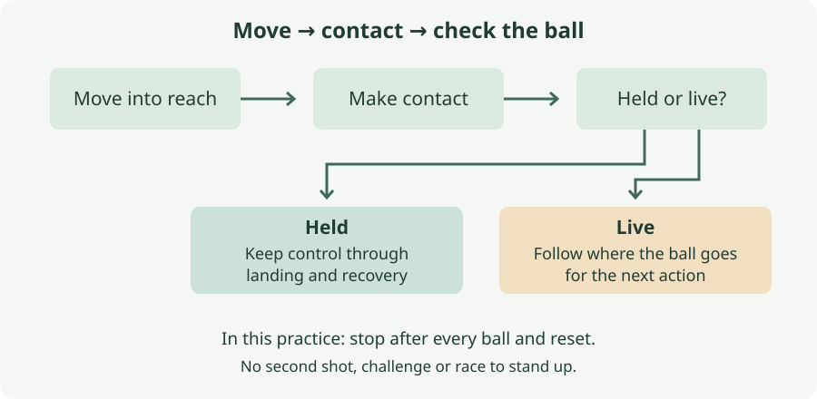

# 3. Move, catch, recover

*How do footwork and handling affect the save and the next action?*

## The situation

A composite continuation of chapter 2, not a remembered goal: the pass arrives in the middle, you adjust, and the shot comes low to your left. You reach it, but the ball comes back into the middle while you are on the ground. The first contact stopped the shot; it did not finish the situation. Your two-match account does not tell us how often this happened, and rebounds are not your main priority. This example gives us a manageable question about the save itself. You explicitly clarified that **diving sideways is difficult**. Can you learn to control a nearby low ball through a controlled landing, without beginning with a leap across the goal?

## What you can change and what you cannot

You can work on moving into reach, making deliberate contact and keeping control through the end of the action. You cannot make every shot catchable. Pace, placement, a deflection or an obscured view can leave you with a touch rather than a hold. A defender must also respond to a loose ball; the second shot is not automatically your fault.

Your height and weight do not tell us which part of the movement is difficult. We have not established whether it is starting sideways, descending, landing, or trusting the action. Nor have we established pain, an injury, or difficulty getting up. The practice separates these parts rather than treating them as one failure to jump.

The present target is a nearby ball at ground level. Reaching a distant corner, diving at an attacker's feet and claiming a high cross are different tasks. None is the test at the end of this chapter.

## The decision: check the ball before the recovery

**After first contact, ask: is the ball held, or is it still live?** This is the book's working cue for connecting the save to the next action. If it is held, retain it while you finish the landing and regain your position. If it is loose, keep following it and prepare to respond to where it actually goes. Touching the ball is not the cue to look away or begin the next attack.

The errors go both ways. Treat a touch as a hold and you may start standing while the ball escapes. Treat a secure hold as a continuing scramble and you may rush your recovery and release it yourself. The cue concerns control, not whether you look quick getting up.

FIFA's defending-goal session includes securing possession before standing and repositioning. We keep that order and remove its demand for a rapid sequence of saves. In the practice below, the server waits for you. In a match, a loose ball may require another action before you can stand; the waiting server does not simulate that pressure.

### Move close enough to make the contact useful

Chapter 2 brings you towards the new shooting angle. Here the movement continues into the save. A slow ball within standing reach is an opportunity to move behind it and collect without a dive. Practising sideways saves does not mean choosing one for every delivery.

For the gentle ground collections in this practice, lower through bent knees, bring your hands behind and under the ball, and gather it in front. Do not reach down from an upright position and hope that fingertips stop it. If the delivery is too wide for the agreed standing version, let it pass and reset. The server changes the delivery; you do not have to improvise a fall.

### A low save starts with lowering, not height

Keeperstop's youth introduction begins with a stationary ball and controlled lowering, then adds a serve, and later a standing start. That progression is useful here because the ball can wait while you learn the movement. It is not evidence that a child's kneeling position will suit your knees, or that you should complete every stage in one session.

For the low collapse save, the technical model is a step towards the ball, lowering through the leg on that side, hands meeting the ball in front, and a controlled descent onto the side of the body. Jeff Benjamin's diving guide describes the side landing through hip and shoulder, with the body still facing the ball. This differs from turning onto your stomach or throwing yourself backwards. It is also different from an airborne extension save.

Keep the ball visible in front of you through the movement. The hands are there to control it; do not abandon it to stab a straight supporting arm into the ground. If you cannot lower without a hard fall, or the landing hurts, stop the ground version. A teammate can notice a dropped ball or a turn onto your stomach, but that does not make them a goalkeeper coach. An uncertain landing needs a demonstration and feedback from someone who can teach it, before you add a moving ball.

### A useful save need not end in a catch

England Football Learning describes a parry as directing an uncatchable ball away from danger, for example towards the side rather than back into the middle. That is a different outcome from a ball spilling unintentionally. In a match, do not judge every touch by whether you held it. Follow where it went and who can reach it.

The beginner practice uses deliveries you should be able to hold. We are not adding hard shots to force a parry or asking you to learn several saving actions at once. If a gentle ball repeatedly spills, slow the delivery or return to the stationary version. More pace would hide the part you are trying to learn.

## The practice: one ball, contact, control, reset

This is one practice in three forms. Every repetition ends with a check of the ball and an unhurried reset. The repetition counts and progression gates are the book's suggestions, not a tested prescription for your body. Choose one stage for the session; the stages are not a circuit to finish.

Use level, clear, yielding grass for any ground work, away from posts, other players and spare balls. On hard or unsuitable ground, use the standing form. Begin after your normal warm-up and some easy movement and handling. Stop a stage if it causes pain or the descent becomes uncontrolled. No slides, attacker challenges, airborne dives or second shots belong in this practice.

### Alone: let the ball wait

Use one ball and a marker for your starting place. Begin standing, with the ball on the ground close enough to collect after one comfortable sideways step. Move behind it, lower, gather with both hands, check that it is controlled, and return to your starting position. Put it on the other side for the next repetition. Do three on each side, with a pause after each. Good means you keep the ball through the return, rather than scooping it up and immediately dropping it to hurry back.

For a ground introduction, first settle onto your side with the ball in your hands, using your normal comfortable way of getting down. Hold it in front where you can see it. This rehearses the finish without rehearsing a fall. Do three placements on each side, resting between them. If being on the ground or getting back up is uncomfortable, keep the standing version.

The next stage, preferably first tried with someone who can check the landing, uses a stationary ball beside and slightly ahead of you. Start kneeling only if that position is comfortable. Keep the ball close enough that you can reach it while slowly lowering onto your side, rather than launching towards it. Take it with both hands, retain it as your side reaches the ground, pause, then get up in a comfortable way. Do three on each side. Do not twist a planted knee to manufacture the movement.

Good is a controlled descent, the ball still held at the finish, and no need to turn onto your stomach to complete the reach. If kneeling does not suit you, do not jump straight to falling from standing. Remain with the standing collection or side-position rehearsal until the ground movement can be taught in a suitable starting position. Solo work cannot tell you everything about a landing you cannot see.

### With one teammate: add a roll after the landing is controlled

One serves and one keeps goal, with a ball and two markers for the working area. The teammate starts about four metres away. That distance is a convenient starting setup, not a technical threshold. They roll gently towards your standing collection range. Do six deliveries, three to each side, with the destination agreed before each roll. They wait until you have checked the hold and returned the ball. Good is contact that becomes possession and stays possession through the reset.

If you are working on the ground progression, have the teammate watch three stationary-ball repetitions on each side first. Use the same comfortable low starting position as in the solo form. They look for control of the descent and retention of the ball. Ask them to stop if you turn onto your front, lose the ball during landing, or fall harder as you tire. Their observation is a check, not proof that the technique is correct.

Only when that stage is controlled should they replace the stationary ball with a slow roll to the same nearby place. Do three rolls to each side, naming the side beforehand and waiting between them. Keep the starting position unchanged. You have added timing; there is no reason to add height or reach as well.

Later, with the lowering and landing checked, rehearse from a standing start with the stationary ball: step towards it, lower, take it and finish on your side. Use three repetitions on each side. A served ball from standing is a later progression, not today's compulsory ending. Increase only one difficulty at a time. If control disappears, return to the preceding stage rather than asking for a harder shot.

Your teammate never races you to the ball or follows a spill. Retrieve it and reset. This teaches the low save, not the breakaway commitment. The no-diving alternative remains the six standing collections, with enough time to move behind each delivery.

### With the squad: connect it to the pass across goal

Use the chapter 2 arrangement: a wide passer, a central receiver and you in goal. One ball is enough. The passer rolls into the middle; you adjust; the receiver controls it and sends a gentle ground delivery within your agreed standing reach. Everyone stops after contact. You check the ball, regain your position and return it. No one finishes a rebound.

Do four repetitions from each flank. Good is the complete sequence: you follow the pass, prepare, collect and retain the ball through the reset. The receiver leaves enough time for each part. If their delivery is too hard or wide, change it before the next repetition.

A controlled low save can replace the standing collection only at the stage you have already practised with your teammate. Agree the side and nearby destination. Keep the receiving touch and slow delivery; remove any race to get down. There is no reward for covering more of the goal. If the squad cannot keep that agreement, use the pair form separately and keep this form standing.

The squad version borrows the angle change from FIFA's penalty-area work. It adds context without adding contact or live rebound play. Your teammates practise supplying a learnable ball; they are not testing how many they can score.

## Where it stops

This progression establishes neither full-goal reach nor readiness for a live smother. An attacker arriving at the ball adds feet, momentum and a commitment decision that are absent here. Chapter 4's stay-or-go practice therefore remains standing. Learning a low landing does not automatically authorise adding a dive to it.

Recovery here is deliberately unhurried. No stopwatch, hands-free rise or rapid second save is required. A match may expose a need for faster recovery; we have not established that limitation from your account. First find whether control survives the save you can already practise.

## Next

Return to chapter 4 with a clearer separation between choosing to commit and executing a save. Crosses and aerial claims remain for chapter 5.

## The observation: where did the ball finish?

After the next match, record one thing for each save you remember: **where was the ball immediately after the first saving action?** Use `held`, `loose wide`, `loose central`, or `unsure`. A line can read `low shot — loose central`. Include successful saves; a goal alone tells you little about the first contact.

Held means control survived the action, including landing if there was one. Wide and central describe the ball's destination, not a verdict about whether you should have caught it. A deliberate parry can be useful; a wide rebound can still reach an attacker. Unsure is preferable to reconstructing the action from the final score.

A run of central loose balls gives the handling practice a question to investigate. It does not distinguish an uncatchable shot from a poor contact without more evidence. A run of holds confirms that some saves ended in possession; it does not measure your diving range. Write the destination you remember and leave the cause open.

*Sources: Keeperstop, [At Home Youth Diving for Goalkeepers](https://www.keeperstop.com/blogs/goalkeeper_drills-diving_extensions_reaction_saves/goalkeeper_drills-diving_extensions_reaction_saves-at_home_youth_diving_for_goalkeepers); Jeff Benjamin, [Diving](https://www.jbgoalkeeping.com/dive.html) and [Basic catching](https://www.jbgoalkeeping.com/ts_catch.html); FIFA Training Centre, [Defending the goal](https://www.fifatrainingcentre.com/en/environment/fifa-goalkeeper-training/sessions/goalkeeping-fundamentals-defending-the-goal.php) and [Defending the penalty area](https://www.fifatrainingcentre.com/en/environment/fifa-goalkeeper-training/sessions/goalkeeping-fundamentals-defending-the-penalty-area.php); England Football Learning, [Different saving actions for goalkeepers](https://learn.englandfootball.com/articles-and-resources/coaching/resources/2023/Different-saving-actions-for-goalkeepers). The composite, working cue, diagram, adult practice adaptations, doses and observation are the book's own; source text checked, videos not visually reviewed.*
