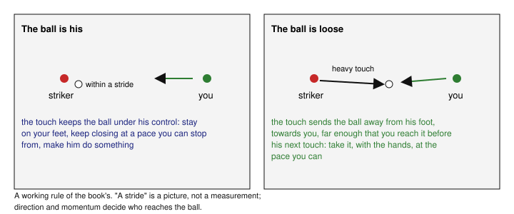
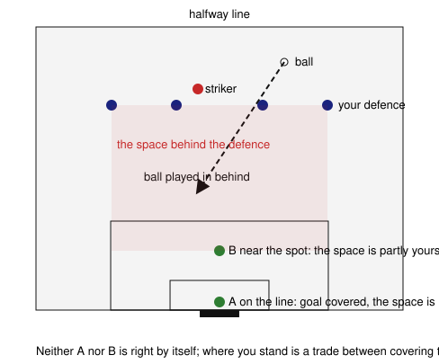
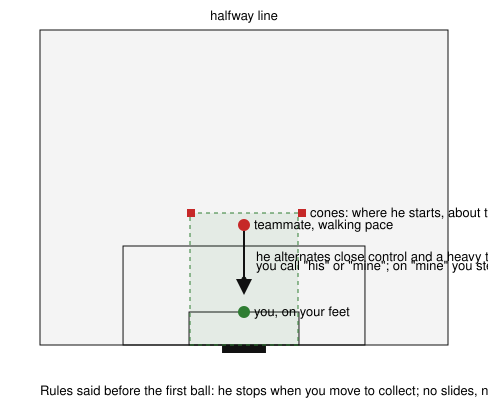

# 4. Face the breakaway

*When should I advance, hold my position or commit?*

## The situation

A composite example, built from what you reported and nothing else: a defender's mistake, a striker through on his own, you on your line because that is where five-a-side taught you to be, and a slide, legs first, meant to make him hesitate. He does not hesitate; he moves the ball to the side and walks it in. How far away he was, where the ball was when you went, how long you had: none of that was recorded, and the chapter does not pretend to know it. By your own estimate, across two matches, something like four goals in ten began this way, and of those roughly six in ten ended with the striker past you and four with a shot; estimates, not counts. The question this chapter answers is the one you asked afterwards: not whether to go hands-first instead, but when to go at all.

## What you can change and what you cannot

The pass that put him through is not yours. It is the defence's, or the gap's, and chapter 6 is about the words that make it happen less often. From the moment he is through, three things are yours, in the order they happen.

The first is where you were standing when it happened. A keeper on the line while the defence is far up the pitch has given the striker the whole penalty area to choose in, and himself the longest run to close it. That is the five-a-side habit, and it is one of position, not technique. The second is the pace and shape of your approach: how fast you come, how tall you are, and whether you are still able to stop and change direction when he changes his. The third is the moment you commit, which means the moment you can no longer follow his next touch because your body has gone one way. A slide is a commitment. So is a dive. So is dropping into a spread shape a stride too early. The slide you describe as a reflex is the third thing arriving before the second has been done.

The shots are a different case. Some were good finishes against a keeper who had done the first two things, and those go in the gap column. The ones to look at are shots faced from close in while still moving, because a keeper moving when the ball leaves the foot has made the shot easier; that is chapter 2's subject.

## The decision: is the ball his or is it loose

The decision is about the ball, not the striker. Every time he touches it, it leaves his foot and comes back under his control a moment later, and what it does in between is most of your information. **The cue to commit, a working rule of the book's and not a sourced one: a touch that sends the ball away from his foot and towards you, far enough that you will reach it before his next touch.** "A stride" is a way to picture that distance, not a measurement; a heavy touch played sideways, or one you would reach only by stretching while he is already moving, does not qualify, because who reaches a ball first is decided by direction and momentum as much as by distance. In that moment the ball is loose, it is yours, and the action is to take it, with the hands, at the pace you can. If the touch keeps the ball under his control, the ball is his, and the action is to stay on your feet, keep closing at a pace you could stop from, and make him do something: shoot, or take another touch, which is another chance for the cue.

That is the whole decision, and the two ways to get it wrong are the two feelings you already know.

Commit while the ball is his and you have told him what you are doing. The England Football Learning session in the book's sources makes this correction six times in fourteen minutes, to academy keepers, and each time about a particular repetition in which a ball had been there to be taken and the keeper had slowed to make a block or spread shape instead: the moment you slow down into the shape, the hips and knees go out, a striker with his head up sees it and goes around instead of shooting. The transferable point is narrow. It is not "always go through with the hands"; it is that once you have decided to go, decelerating into a shape gives him the decision back. The hypothesis this chapter offers about your slide, and it is a hypothesis until the observation below has some lines in it, is that it is that shape made with the legs, from a distance at which the ball was probably still his.

Never commit and he keeps the ball until the goal is close enough to pick a corner, or walks it past you. The cue exists so that "never" is not the answer either: a striker running at speed with a keeper coming towards him is choosing where to look, and a heavy touch is common. When it comes and you are on your feet, the ball is yours and the situation is over.

Between the two, while the ball is his, the FIFA session in the sources gives a reference distance for your shape: outside about three metres from the ball its keepers stay tall and upright, ready for a shot, and inside it they get low with the hands low. The distance is not a switch to flip; it is what it helps you notice. Outside it, the thing he can do to you is shoot, and a tall keeper covers a shot. Inside it, the thing that can happen is a touch that leaves the ball within reach of both of you, and a low keeper takes that ball. Walk three metres out beside the goal so you know what it looks like from your eyes, and then use it as a question, "which of the two can happen from here", rather than as an instruction. The same session's coach makes one more point that matters for you specifically: when you do go, go with a definite choice, hand or foot, because a keeper who does neither and folds in between is beaten every time.

One thing this chapter does not do is replace your slide with a hands-first dive. A dive is a commitment too, with a landing, and the landing is chapter 3's subject. Until you have that, the commitment in this chapter is made standing, at the pace you can, and its most common form is not a dive at all: it is a step and a bend to a ball that has run loose, taken into the chest. The cue is the same at any speed. The speed is yours, and it is the speed at which you can still stop.

## Where to stand before it happens

The first of the three things is decided before the striker is through, and it is the habit that costs most. There is no rule that fixes the distance, because the position is a trade between two things you cannot have at once. Nearer the line, the goal is covered and a shot from range is yours to save; the space between you and the defence is his, and a ball played into it is his to reach first. Further out, that space is partly yours, a ball played in behind can be met before he arrives, and a shot over you or a run past you costs more. Where the trade sits depends on where your defence is, how fast the runner is, and how fast you are, and the last of those is the one five-a-side never made you weigh, because there the line was always close enough. The FA session in the sources, on defending the space in behind, exists because this is the part of goalkeeping outfield players never learn: the keeper's position is set by where the space behind the defence is, not by where the goal is. What to do with that in the next match is not a distance but a check: as the ball crosses halfway, notice where you are standing and where the space behind your last defender is, and ask whether you could reach a ball played into it. The observation at the end records the answer.

## The practice: read the touch

The one practice is the session filed in the book's notes, kept to footwork and standing collections as agreed, with the cue written into it. Twenty minutes, one ball, two cones, a goal, even grass, and the rule that ends every repetition before contact: the teammate stops the moment you move to collect, and nobody slides.

**With one teammate.** Five stages. *Prepare*, four minutes: sideways steps, gentle catches, ground balls into the chest from a roll. *Follow*, four minutes: he dribbles at you slowly and changes direction; you stay on your feet and follow the next touch, and you reset before either of you is crowded. *Read the touch*, five minutes, the heart of it: he alternates close control with a deliberately heavy touch towards you, then stops; you say "his" or "mine" out loud as you decide, and on "mine" you step through and take the ball standing. Good is a close-control touch that does not move you, and a loose ball taken without a race. *Add the shot*, five minutes: from the penalty spot he either shoots along the ground, gently, or keeps coming; you stay mobile and tall through the dribble and set when the shot comes. Good is responding to what he did rather than falling before it. *Review*, two minutes: two repetitions, one where you chose and one where your body chose, and you name the cue you used or missed. The stages adapt the FIFA session's one-against-one and closing-down parts; the "his" or "mine" call is the book's.

Start at walking pace, and start the shot stage from eleven metres. Each week the third stage feels easy, shorten his starting distance by a stride and let him mix the touches without telling you. Increase uncertainty before speed; never the other way round.

**Alone.** The decision cannot be practised alone, because there is no touch to read. What can be practised is comfortable movement in the shapes the decision uses: from the penalty spot, walk in towards a cone at the six-yard line as if closing a striker, tall and balanced, and somewhere around the cone, using it as a reference and not a trigger, lower yourself with the hands low, still able to stop and step sideways; then step through a ball you have rolled ahead of yourself and take it standing. Ten repetitions, no more, and the point is being able to move between the two heights without losing your feet. A wall gives ground balls for the collections if there is no one to roll them.

**With the squad.** At the one session, the last ten minutes: the FIFA session's two-against-two game, eighteen by twelve metres, keepers defending with their hands, attackers scoring by dribbling over the end line or into a small goal. It gives you the cue with the ball loose often, because in a small area every touch is heavy. The same limits as the pair form apply and are said before the first ball: the attacker stops when a keeper moves to collect, no slides, no contact, and the pace is jogging until everybody has done it once. If the squad will not play it, one striker and you, ten balls, the same rules; and you tell him before the first ball to go round you whenever your hips go, because that is the information you need.

## The observation: where was the ball when I went

For every one-on-one in the next match, one line in the match file: **was the ball his, loose, or unsure when I committed, and did I slow down first, or unsure.** Two words each, and "unsure" is an honest answer that you should expect to give often at first; a fast encounter does not leave a clean memory, and an invented "loose" is worse than a blank. Add where you were standing when the ball crossed halfway, line or out, and whether you could have reached the ball played in behind: yes, no, unsure. Three or four such lines across a couple of matches will say more than the two matches you have already played, because they record the moment before the outcome. If most lines say "unsure", the first job is seeing, which is chapter 2. If every line says "his, slowed", the decision is the problem and the pair form is the session. If the lines say "loose, went" and the goals still came, the problem has moved to chapter 3, technique, or to chapter 2, the approach; that is progress. If the lines say "line" and "could not have reached it", the position is the thing to change, and it is the cheapest.

## Where it stops

The video's corrections were made to particular repetitions at academy tempo, and "go all the way through" there means a speed you will not have and a landing you have not learned; the book takes only the decision from it, that deceleration into a shape is the striker's cue, and leaves the speed to you. The three-metre figure is from an elite session; it is a starting point to walk out and test, not a law. And a striker who is genuinely too quick, who keeps the ball inside a stride at a pace you cannot close, has beaten the decision and not you; that goal goes in the gap column, and the answer to it is the position before it happened and the words in chapter 6.

## Next

Chapter 2 goes back to the moment before every one of these, and before the flank-to-middle goals that were the other three in ten: where you stand as the ball moves, and how you are set when it is struck.

*Sources: FIFA Training Centre, "Goalkeeper: in and out of possession" (the three-metre rule and postures, the one-against-one and closing-down parts, the two-against-two game); England Football Learning, "Defend the goal" (premeditated shapes, deceleration as the striker's cue, a definite hand-or-foot choice), from its captions; The FA, "Goalkeeping: defending the space in behind" (the aim only). The cue, the position rule and the "his" or "mine" call are the book's own.*
