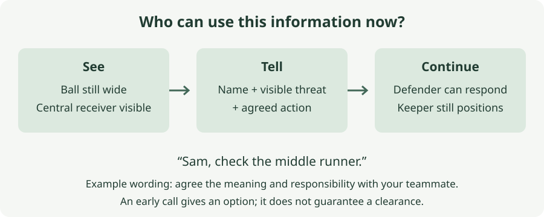

# 6. Organise the defence

*What should I say, to whom, and when?*

## The situation

A composite of the flank-to-middle pattern, not a reconstructed goal: the wide player has the ball, your nearest defender is watching them, and another attacker is waiting centrally. You can see the receiver and a possible pass. You shout “watch him”, but nobody knows who “him” means. The pass arrives and the receiver shoots. Perhaps a clearer warning would have helped; perhaps the defender was already occupied and could not get there. Neither was recorded in your matches. Your account includes defensive mistakes followed by breakaways and accurate finishes after central passes. It does not tell us what anybody said. This chapter asks what useful information you can supply before the pass, without claiming a shout could have prevented every goal.

## What you can change and what you cannot

You can choose a recipient, describe something you can actually see and speak while there is still a possible response. You cannot give a teammate more speed, guarantee they hear you, or replace the team's defensive arrangement with instructions invented during an attack.

Your view may reveal a receiver a defender has not noticed. It may also hide a player behind another body. Being in goal does not mean you see everything or understand every teammate's responsibility. A defender who stays with one opponent may be doing an agreed job, not ignoring another.

The keeper's part is therefore specific: share useful information and keep doing your own positioning. Chapter 2's adjustment with the pass still applies. Explaining the danger aloud while remaining at the old angle would leave your own task unfinished.

## The decision: who can use this information now?

**When you see a threat a defender may not have accounted for, address the teammate who can respond, identify the threat, and use an action you have agreed beforehand.** Do it while that action is still possible. This is the book's working rule, not a source's exact wording or permission to direct every defender at once.

In the chapter's example, the working phrase is **“Sam, check the middle runner.”** Sam is an illustrative name, not one of your teammates. “Check” means notice the receiver and respond within the role agreed for this practice. It does not mean abandon your present opponent, rush forward to tackle, or follow every runner wherever they go. If that meaning is unclear to the defender, choose words together before the next repetition.

Say too little and a real warning may reach nobody. Say too much, or prescribe an action you have not understood, and you may distract a defender or draw them away from their job. The objective is information that changes a useful option, not a running commentary.

FIFA's defending-goal-or-space session connects the keeper's positioning with decisions and actions. In its team game, the coaching points include scanning and giving defenders information to reduce vulnerability to one-on-ones and two-on-ones. We borrow that shared responsibility, not its formations, intensity or promise of preventing a particular goal.

### Agree the job before trying to improve the call

At training, ask one centre-back how the team wants to handle the central receiver when the ball is wide. Who approaches the ball, who deals with the receiver, and who coordinates a change? These are questions about the existing arrangement. The chapter does not tell your side to adopt individual marking or a particular back line.

For the practice below, give one defender the explicit job of checking the central receiver. That removes an uncertainty so you can work on the message. In a match there may be several receivers and a different allocation. Do not apply the practice assignment as though it were the team's whole system.

Agree the name or nickname they recognise on the pitch, and the phrase they find useful. If they already see the runner, your warning may add nothing; they can tell you that in the pause. If they cannot leave their current job, the answer may require another teammate. Calling their name again does not create spare defensive cover.

### Describe the threat you see

“Sam, check the middle runner” gives a recipient and a place to inspect. “Somebody mark someone” supplies neither. A shouted accusation after the shot supplies no next action at all.

Use the ball and goal as references when agreeing words, and walk through their meaning from both positions. Your left may not be the defender's left when they are turned towards the touchline. “Inside” can also mean different things unless you have rehearsed it. There is no need to create a large vocabulary. One phrase understood by one teammate is enough to begin.

Do not call a receiver unmarked merely because they are not standing beside a defender. You may be missing the team's intended cover. Describe the visible player or movement, and let the agreement determine the response. If the view is obscured, do not turn a guess into a confident instruction.

### Speak before the option disappears

In this example the useful window begins when you notice the central receiver while the ball remains wide. Once the pass reaches them, a warning to check them may already be late. The defender may now need to respond to the finish; your keeper's task has also changed.

This is not a rule to look away from the ball on a fixed schedule. Use the view you have, and update it as the attack develops. If you have not seen the runner until the pass travels, give the information you can still usefully give and keep preparing for the shot. Afterwards, record the timing you remember rather than claiming you noticed earlier.

The FA's out-of-possession session asks for communication at the right time and connects it with the unit's positioning and decisions. Its examples include “hold”, “squeeze” and “keeper's”. Those are different jobs, not interchangeable noises. Do not introduce a line movement because the word appears in a coaching session: agree who calls it and how your team responds.

### Keep the warning separate from the review

During the attack, say what helps the next action. In the pause, ask whether the defender heard it and what they understood. “Did you hear the middle-runner call before the pass?” is a question you can answer together. “Why did you let him score?” combines the result, responsibility and a judgement before you have established any of them.

Your remembered share of defender mistakes is a starting description, not a count proving those goals were preventable through communication. The striker may have been quicker, the defender may have had two jobs, or the ball may have arrived too soon. A warning that arrived clearly can still be followed by a goal. A poor warning can be followed by a clearance.

Chapter 5's “keeper” and agreed “away” calls still describe who deals with a delivery. Here you work on information before a pass creates that delivery or a finish. The two chapters connect without asking you to add a new catalogue of commands.

## The practice: see the receiver, send the message, continue

This is one practice in three forms. Its wording, setups and doses are the book's adaptations of the FA shared-defending session and FIFA's emphasis on information and positioning. Neither source demonstrates that these repetitions will improve your match communication.

Use one ball, a goal or two markers, and a few markers for the wide and central positions. Everything begins at walking pace. There are no tackles, shots, slides, aerial deliveries or races to the ball. A repetition stops after the central reception or defensive interception. The aim is to make the message and its timing visible.

### Alone: practise a sentence with a visible reference

Place the ball at a wide marker and another marker in the middle to represent the receiver. Stand in your keeper's position. Look at the ball, locate the central marker in the view available to you, and say your agreed defender's name and the short message. Then rehearse your adjustment towards the imagined central finish. Walk back and reset.

Do three repetitions with the ball on each side. Good means you can identify the reference and say the phrase without stopping your own movement or adding a speech. Keep the markers within easy view; there is no reaction challenge here.

For the next three on each side, imagine that the defender has already accounted for the receiver. Rehearse continuing to position without an unnecessary repeat of the warning. This is a predictable rehearsal, not evidence that you can recognise a real defender's awareness. A marker cannot hear you or tell you whether the phrase makes sense. The pair form supplies that missing feedback.

### With one teammate: establish what the words mean

Your teammate takes the defender's role, with the central marker representing the receiver and the ball still at the wide marker. Choose positions several comfortable walking steps apart, where you can hear each other without shouting continuously. Walk the arrangement together first. They own the central-receiver task in this practice; checking the marker should not require a sprint or leave another real attacker free.

They begin facing the wide ball. You locate the central marker, call the agreed phrase, and they turn enough to find it and move into the position you have agreed for dealing with that receiver. You continue your keeper's adjustment. Stop, then ask them to repeat what they heard and explain the action they understood.

Do three repetitions from each side. Good means the teammate hears who is addressed, identifies the intended receiver and understands the task without needing an explanation during the movement. If they hear the wrong place or action, revise the words together and repeat more slowly.

Next let the teammate start with the receiver already checked on alternate repetitions. Do another three from each side. You are learning when the extra information is useful, rather than being required to shout every time. Ask after the repetition whether your warning added anything.

There is no moving pass or real attacker in this form. It tests the shared meaning, audibility and continuity of your own movement. It cannot establish that the call was early enough to prevent a match chance. Do not solve that limitation by making the defender run faster between markers.

### With the squad: give the warning a deadline

Use you, a defender, a wide passer and a central receiver. Begin with the defender watching the wide ball and the receiver in a place you can see. Agree that the defender deals with this receiver; the passer keeps possession until the receiver is ready. Choose spacing that allows everybody to work at walking pace, outside collision distance.

You identify the receiver and give the agreed call. The defender checks and adjusts. The passer then rolls gently into the middle, and the receiver controls without shooting. You follow the pass and prepare. Stop after the reception, or after a gentle interception if the defender reaches the passing lane without contact.

Do four repetitions from each flank. Good is a message the defender understands before the pass, followed by a visible response and your own continued positioning. Ask the defender what they heard; ask the passer whether your call preceded the ball leaving their foot. These are checks within the practice, not proof that the defence was tactically correct.

For a later set of four from each side, remove the wait for your call. The receiver walks into the central receiving place while the passer retains the ball, and the passer chooses when to roll it. Keep the pace slow enough for the defender to respond without chasing. Your warning now depends on noticing the receiver, rather than starting a memorised sequence. If nobody has time to use the message, slow the arrangement before adding difficulty.

The receiver never runs behind the defender for a one-on-one and never finishes a loose ball. This simplifies the attacks in the sources so you can isolate the warning. If you want to add live play later, the team needs to agree the defensive roles again; a successful rehearsal does not settle them.

## Where it stops

Clear communication does not correct a numerical disadvantage or supply marking that nobody has agreed to do. The match can also be noisier, quicker and more confusing than this practice. A defender's visible movement is not proof that they heard you; they may have seen the receiver themselves.

The chapter deliberately leaves coordinated line movement, offside decisions, wall placement and the whole corner arrangement to the team's existing leadership. You can discuss those in a pause without appointing yourself to make every call. Start with useful information you can verify and a teammate willing to test it with you.

## Next

Chapter 7 follows the moment you regain possession: choosing a useful first pass without immediately returning the danger to the defence.

## The observation: before the pass, after it, or no call

After the next match, record one thing for a central-receiver threat you remember noticing and considering a warning about: **when did your warning occur relative to the pass leaving the wide player's foot?** Use `before`, `after`, `no call`, or `unsure`. A line can read `wide ball, middle receiver — before`.

Before does not mean the warning was clear, heard or early enough to help. After includes a call made while the pass travelled or after reception. No call means you remember noticing the threat but did not warn. Unsure means you cannot place the call or the moment of noticing. Do not infer timing from whether the defender intercepted or a goal followed.

Repeated after entries give the practice a question about recognition and timing. Before entries leave wording, hearing and the agreed response to discuss with your defender. No-call entries may reveal hesitation, or that you judged the warning unnecessary; the label alone does not distinguish them. Record the timing you remember, including attacks that ended safely, and leave the result separate.

*Sources: FIFA Training Centre, [Tim Dittmer: Defending the goal or defending the space](https://www.fifatrainingcentre.com/en/practice/elite-sessions/goalkeeper/defending_the_goal_or_the_space.php), especially part 4 coaching points; England Football Learning, [Goalkeeping session: out of possession actions](https://learn.englandfootball.com/sessions/resources/2023/Goalkeeping-session-out-of-possession-actions), coaching tips. The composite, message format, central-receiver agreement, diagram, simplified practices, doses and observation categories are the book's own. Written descriptions checked; videos not visually reviewed.*
