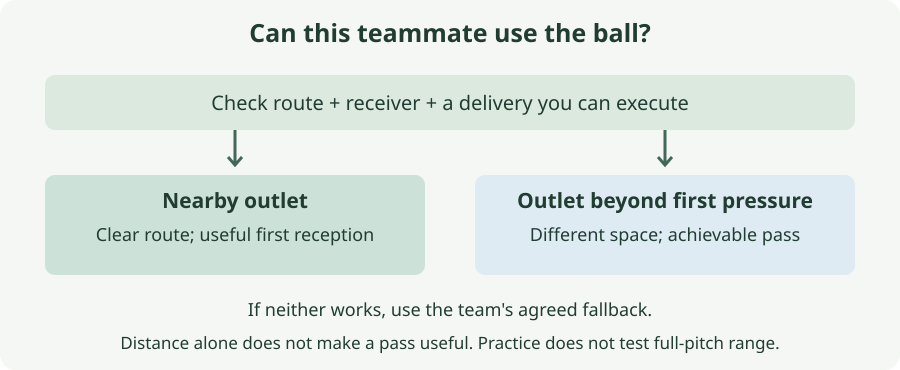

# 7. Start the next attack

*When is a short pass useful, and when should I play longer?*

## The situation

A composite, not a turnover you reported: the ball is at your feet, a centre-back offers a short pass on your right, and an opponent waits between you. Another teammate is farther forward. You can see the first teammate clearly, but seeing them does not mean the passing route is clear. Perhaps a pass beyond that opponent would reach the second teammate; perhaps it would exceed the distance you can deliver accurately. You have not described your distribution or kicking range. This chapter asks how to choose a useful next ball without inventing a fault in your matches or demanding a long kick you cannot yet make.

## What you can change and what you cannot

You can look for a route, notice pressure on the intended receiver and choose a delivery you can execute. You can agree an outlet with your teammates and remain available after passing. You cannot make an offered teammate unpressured, guarantee their first touch, or create an accurate long pass simply because the nearby options are blocked.

Your reported difficulty with sideways diving does not establish a limit on kicking or throwing. Those abilities remain unassessed. Equally, playing five-a-side does not establish that you can deliver over a full-size pitch. The practice starts with manageable ground passes and changes the receiving options before increasing distance.

The team's intended approach remains the team's. Ask whether they want a short start when available, who offers beyond the first opponent, and what the fallback is when neither can be reached. This chapter supplies a question for that arrangement, not a new build-up system.

## The decision: can this teammate use the ball you are sending?

**Before the pass, check the route and the receiver: can you deliver the ball there, and can the teammate control it with a useful next action available?** If the intended short outlet fails that check, look for another agreed outlet, including one beyond the first pressure. This is the book's working rule, not a requirement to play short whenever you can or long whenever an opponent approaches.

The errors go both ways. A short pass can transfer the immediate danger to a teammate who has no time to use it. An automatic long clearance can give away a ball you could have kept, or miss a receiver beyond your reliable range. The choice depends on available players and your delivery, not the prestige of building from the back or the distance the ball travels.

FIFA's distribution framework distinguishes short play, passes through pressure, and passes into or beyond other spaces. It treats longer distribution as a possible attacking choice, not merely an emergency. We keep that distinction without importing its professional examples or expecting their kicking range.

### A visible teammate is only part of the option

Look between the ball and the receiver. An opponent can block that route while standing some distance from the teammate. A pass you could complete on an empty pitch may now require a different angle, timing or recipient.

Then look at the receiving situation. Is the teammate ready for the ball? Can an opponent arrive as they control it? Can they turn, pass on or return it using the team's agreed support? These are questions about the likely first action, not a demand to predict the whole attack.

A teammate calling for the ball supplies information about what they want; it does not remove the opponent you can see. Tell them if you cannot use that route and look again. If they adjust their position, the answer may change. Do not treat a blocked lane as a permanent verdict on that player.

You can also miss a useful outlet by deciding before you look. FIFA's build-up session asks keepers to inspect options before receiving and connects space, passing angles, timing and execution. Here, preparation means taking in the view available to you, not looking away from an approaching ball according to a fixed head-turn schedule.

### Longer means a different receiving situation

A pass beyond the first opponent may give a teammate room that the short receiver lacks. That can be a ground pass at a modest distance, a throw when you legally hold the ball, or a longer kick you already know how to deliver. The method must fit the starting situation. Having the ball in your hands after a save and receiving it at your feet are not interchangeable.

The beginner practice below starts with the ball on the ground and uses feet throughout. It does not teach release from the hands, a drop kick or a goal-kick technique. Nor does it ask you to put a held ball down merely to copy the exercise when an opponent is nearby.

Sending farther is useful only if somebody can benefit from it. Agree who offers there and what happens if the first contact is contested. Space beyond the opponent is not automatically a teammate's possession. Your side may also choose a clearance to relieve immediate pressure even when keeping possession is unlikely. Name that purpose rather than judging it as a failed short pass.

If the team relies on a longer restart you cannot deliver reliably, tell them at training. A teammate taking that restart or a different outlet may be a better arrangement than asking for repeated maximum efforts. We have no evidence yet that this is needed in your case. The question belongs to the team's plan, not an assumption based on your height or weight.

### The pass includes its arrival

Agree which side of the receiver you are aiming for and how much pace they can manage. In the practice, a ground pass should reach them without requiring a lunge or an immediate race with the blocker. A ball that technically touches their foot but leaves them scrambling has not met that target.

Too little pace can give a blocker time to arrive. Too much can make the first touch harder. Rather than writing a compulsory speed or distance, use the teammate's actual reception as feedback. If the pass keeps arriving behind them or bouncing awkwardly, simplify the delivery before adding an opponent.

Stay involved after releasing. The receiver may need a return route, and possession may be lost. FIFA's build-up session includes continued support and defensive repositioning after a turnover. The present practice stops early, so it cannot prove you can manage those transitions in a match. It still asks you to move into a useful supporting position rather than watch the pass from where you delivered it.

## The practice: an outlet near, an outlet beyond

This is one practice in solo, pair and squad forms, adapted from FIFA's build-up passing work and the FA's end-lines possession session. The distances, gates, repetitions and stopping rules are the book's own. They have not been tested with you.

Use one ball and a few markers on clear ground. Warm up with easy movement and passing. Begin with comfortable ground passes, no driven aerial balls, tackling, shots or races. The two distances model different receiving options; they do not measure full-pitch range. If the farther one strains the delivery, bring it closer while keeping it beyond the simulated first pressure.

### Alone: test the delivery, not the decision

Mark your starting place and two receiving gates, each about one metre wide. Put one roughly four metres away and the other roughly eight metres away, at a different angle. These are adjustable starting distances, not tactical thresholds. Make sure both passes have clear space beyond the gate.

Look up to locate the intended gate, bring attention back to the ball and pass through it along the ground. Walk to retrieve the ball, then reset. Do four to each gate. Use the foot you can control; this is not a weaker-foot test. Good means the ball travels through the intended gate with repeatable direction and manageable pace, rather than requiring a maximum strike to reach it.

For a second set of four to each, place a marker in the route to the other gate to represent blocked pressure. Rehearse identifying the open route before delivering. You know where you put the marker, so this is a predictable rehearsal. A cone cannot intercept, a gate cannot take a first touch, and hitting the target does not establish that a match receiver could use the ball.

Do not widen the gate to hide an uncontrolled pass. First reduce the distance or slow the sequence. Record what you can actually repeat if the team needs to discuss your range.

### With one teammate: inspect the first reception

Keep the two receiving places. Your teammate takes one at a time, first near and then farther away. Before each block agree where they want the ball to arrive. You pass, they control, and they return a gentle ground ball when you have offered a clear angle. Stop and reset. Do four passes to each receiving place.

Good means they can control the delivery and make that return without chasing your pass. Ask which arrivals gave them a useful first touch. If the farther place requires more force than you can direct, shorten it. The numbers describe the setup; the teammate's reception tells you whether it is manageable.

Next put a marker in the direct route and let the teammate adjust a few walking steps to offer another angle. Do another four at each receiving distance. Find the new route rather than passing through the imagined opponent. Continue offering support after you deliver.

There is only one receiver and no active opponent. This tests arrival quality and an adjusted angle; it cannot test choosing between two teammates or passing beyond a real press. Do not send towards an empty farther gate and count that as a teammate reached. The squad form supplies the missing choice.

### With the squad: make one route unavailable

Use you, two receivers and one blocker. Place the receivers at the manageable near and farther distances from the earlier forms, with the farther receiver beyond the blocker's starting position and at a different angle. The blocker begins far enough from all three of you to close a lane by walking without contact.

First use four repetitions with the blocker visibly closing the short lane, then four with them closing the farther lane. Read the route and check the receiver, pass to the available teammate, offer a return angle, and stop after they control and return the ball. Nobody tackles or shoots. If the blocker can reach both lanes at once, change the angles or spacing before continuing.

Good is a delivery the chosen teammate can use, not merely one that avoided the blocker. The receivers should tell you when they are ready and whether the first touch gave them an option. The blocker can intercept gently without chasing; otherwise they stop once the outlet receives, leaving the return uncontested. Stop on an interception and reset.

For a later set of eight, let the blocker choose which lane to close after you have prepared the ball. They walk; the receivers can make small adjustments. You must update the option rather than repeat the previous pattern. If neither is available, say “reset” and stop the repetition. This is a teaching pause, not advice to wait indefinitely with the ball under match pressure.

Before using the idea in a match, agree the fallback when both outlets are blocked. That might be another teammate, a longer ball you can deliver, or a clearance appropriate to the situation. The practice does not secretly supply a third route or force a pass just so every repetition ends in completion.

The FA end-lines session uses possession between keepers and teams, with support from an additional player. We retain the idea that the next recipient and support matter, while reducing it to two outlets and one walking blocker. FIFA's build-up session supplies changing angles and blocked lanes. Our simplified return and reset remove live turnovers and finishing.

## Where it stops

This is an open-play passing rehearsal, not a reproduction of a goal kick's restart conditions. It leaves out fast pressing, aerial reception, full-length kicking and opponents chasing a second ball. Completing eight modest passes cannot establish that you should play through a match press.

A team instruction to start short still needs a usable route. A team instruction to play longer still needs an achievable delivery and somebody prepared to contest or receive it. Discuss repeated difficulties at training rather than turning a failed pass into a disagreement about which style of football is correct.

## Next

Chapter 8 uses the observations from these chapters to choose one useful practice for the next session, within the time and teammates you have.

## The observation: what happened at the first reception?

After the next match, record one thing for each intended pass to a teammate you remember: **what happened at the first reception?** Use `usable`, `immediately contested`, `not received`, or `unsure`. A line can read `intended outlet — immediately contested`. Deliberate emergency clearances with no intended teammate fall outside this observation.

Usable means the teammate controlled the ball with time for a next action. Immediately contested means an opponent challenged at the reception, even if your team kept it. Not received means the ball did not reach your intended teammate, whether intercepted, missed or out of play. Unsure means the reception is missing from memory. These describe what happened, not whether your original choice was correct.

A run of contested receptions asks whether you noticed pressure, sent the ball to a difficult place, or delivered too slowly. Not-received entries leave both choice and execution open. Usable entries do not prove you found the best attack; they show an outlet was available on those occasions. Include passes that ended safely and leave later possession changes out of this first-reception label.

*Sources: FIFA Training Centre, [Goalkeepers' build-up: supporting, receiving and passing — session plan](https://www.fifatrainingcentre.com/media/native/test/FIFA_Session_Plan_Santangelo.pdf), especially pages 1–4; [Distribution — opportunities from a long goal kick](https://www.fifatrainingcentre.com/en/game/individual-qualities/goalkeeping/distribution-opportunities-from-a-long-goal-kick.php), distribution framework; England Football Learning, [Goalkeeping session: end lines](https://learn.englandfootball.com/sessions/resources/2023/Goalkeeping-session-end-lines). The composite, beginner working rule, diagram, practice adaptations, doses and observation categories are the book's own. Written material checked; videos not visually reviewed.*
