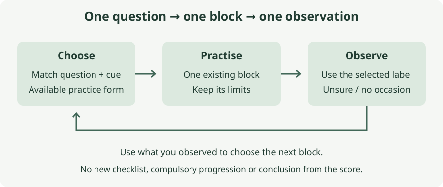

# 8. Train for the next match

*How do I choose a useful session with limited time and equipment?*

## The situation

A composite training evening, not a session you reported: you arrive with one ball and a few minutes before the squad starts. A teammate offers to shoot. You have read about breakaways, position, handling, crosses, communication and distribution. You could ask for a little of everything, or accept ten hard shots and call it goalkeeper training. Neither tells the teammate what you need to learn. Your actual starting priorities are clearer: attackers going round you in one-on-ones, and flank-to-middle passes followed by a finish. With one weekly squad session and no goalkeeper coach, which single question should today's work help you answer?

## What you can change and what you cannot

You can arrive with a purpose, choose a form that fits the people available and tell the server what makes a repetition useful. You cannot reserve teammates indefinitely, make the squad's session your own, or learn every saving action in the time before it begins.

You also cannot manufacture evidence from a score. Two heavy defeats do not establish six technical faults. Your recalled percentages identify situations you care about, not measured training priorities. The remaining goals were outside your interest, not proved unavoidable. Keep the distinction when choosing work.

Sideways diving is a stated difficulty; vertical jumping, landing after a jump and kicking range remain unassessed. Reaching the last chapter does not remove the limits in the earlier ones. A planning system cannot replace somebody checking an uncertain landing or teach contested catches through extra repetition.

## The decision: choose the question you can work on today

**Choose one relevant situation with a cue you can observe, then use the simplest existing practice that lets you work on it with today's people and conditions.** This is the book's working rule for selection, not a formula for allocating training time or a claim that one exercise is always sufficient.

Choose only by the latest goal and you may chase an unusual event while ignoring the pattern you wanted to address. Refuse to change a familiar practice and you may keep repeating something that cannot answer the question anymore. The choice should connect a match situation, an action and something you can notice, while remaining possible today.

The FA's practice-design guidance starts with a purpose and makes that purpose the focus of observation. It also distinguishes practising a movement without opposition from applying it with opposition. Here, a solo rehearsal is useful for its stated part of the problem; it is not evidence that you can read an attacker. Adding teammates supplies information, not automatic permission to add speed or contact.

### Begin with the evidence you have

Read up to three remembered instances of the same situation, including ones that ended safely. You need not reconstruct every goal or wait for another defeat. Ask what was visible and what remains unknown.

For example, `flank to middle — travelling` gives you a question about adjustment and readiness. It does not tell you that your diving was poor. `one-on-one — unsure` does not establish a loose ball you failed to take. The useful next work may be identifying the touch at walking pace, not executing a faster commitment.

If the file has no new entries, start from the priorities in your two-match account. Chapter 4 addresses the breakaway choice; chapter 2 addresses the change from a wide threat to a central finish. Choose one whose practice you can arrange. Do not promote crosses or distribution merely because their chapters are newer.

If the notes are mostly unsure, choose a practice that makes the missing cue visible. In chapter 4 the teammate's controlled and deliberately heavy touches can be separated slowly. In chapter 2 the change in ball position can be walked. That does not recover the past match; it gives you a clearer reference for the next one.

### Use the chapter as a route to practice

The following is a selection map, not a circuit. Chapter 1's review supplies the evidence; chapters 2–7 supply six on-pitch practices. Return to the selected chapter for its setup, repetitions and limits.

| Question in your notes | Practice to revisit | What the existing observation can tell you |
|---|---|---|
| Was I still moving for the central finish? | [2: change the picture, then receive](02-position-before-the-shot.md) | Prepared / travelling / unsure at shooting contact; not proof of the best angle. |
| Did control survive the saving action? | [3: contact, control, reset](03-move-catch-recover.md) | Held / loose wide / loose central / unsure; not proof every shot was catchable. |
| What was the ball doing when I committed? | [4: read the touch](04-face-the-breakaway.md) | His / loose / unsure at commitment, with the chapter's other context left as recorded; not a diagnosis from the result. |
| Who dealt with the airborne delivery? | [5: read, claim or prepare](05-deal-with-crosses-and-corners.md) | First contact by keeper / defender / opponent / untouched / unsure; not a compulsory claim. |
| Did my warning precede the pass? | [6: see, send, continue](06-organise-the-defence.md) | Before / after / no call / unsure; not proof the warning was heard or useful. |
| Could the outlet use my pass? | [7: outlet near, outlet beyond](07-start-the-next-attack.md) | Usable / immediately contested / not received / unsure at first reception; not proof of the best attack. |

Chapter 1 also asks about shots you did not see leave the foot. Treat that as missing information to investigate, rather than attaching a saving error to an unseen shot. You do not have to carry all seven chapters' observations into every match. This week's chosen cue deserves attention; the rest can wait unless a situation stands out naturally.

### Write a card your teammate can act on

Use the [session-card template](../notes/sessions/next-match-card.md), or write five short lines on paper. Name the situation, the cue, the selected chapter and practice form, the stopping point, and the observation you will carry into the match. Add who is available and the setup if somebody else needs to prepare it.

A worked plan, not a new account of your performance:

> Situation: flank pass into the middle. Cue: prepare for the possible finish as the ball reaches the receiver. Practice: chapter 2, pair form, first block only. Stop: five repetitions from each side, or earlier if deliveries or movement cease to be controlled. Match observation: prepared / travelling / unsure.

The card tells the teammate to carry the ball slowly, pause centrally and supply a gentle ground delivery. It does not say “test my reactions”. Good can be seen: you adjust with the ball and can respond at delivery. The pair form still gives more time than a real separate passer and receiver; write that limitation if you are tempted to read its success as match competence.

### Change one difficulty without losing the cue

If every repetition fails before you can notice the cue, slow it down or return to the preceding stage. If you can respond only because the sequence is announced, a later change may be the uncertainty already described in the chapter. Do not also make the delivery harder and shorten the space.

The FA's session-management guidance recommends adapting familiar practices to the challenge and people available rather than overloading the session. The book adds a narrower working restriction: change one thing at a time so you can describe what changed. That is a way to inspect the practice, not a scientifically established training dose.

The earlier chapter's limits still govern. A familiar standing catch does not clear jumping work. A controlled low landing does not clear a live smother. A walking blocker does not clear playing through a fast press. Where the next stage needs instruction you do not have, keep the simpler form and name what is still owed.

## The practice: plan, run, review one block

This chapter's one practice is the cycle of selecting, running and reviewing one existing block. Its three forms depend on who is available; they are alternatives, not three appointments to complete. The planning sequence and example doses are the book's own. The selected chapter supplies the physical setup and boundaries.

The example throughout is chapter 2's first block. You can select another chapter instead, using its stated repetitions rather than adding this example's counts to them. Start after normal warm-up. Include time to set up, return the ball and pause; useful repetitions are not the only minutes the teammate gives you.

### Alone: make the plan and rehearse its part

Take five minutes with your match notes. Inspect up to three instances, write one card and choose the solo form. If there are no new notes, use the remembered priority rather than filling blanks with imagined events.

For the worked example, use a goal or two post markers, plus a wide and central marker. Inspect both angles, then rehearse the wide-to-central adjustment and preparation five times from each side, pausing after each. Stop there. Good is a balanced finish facing the central reference; a marker supplies neither a pass nor a surprise finish.

Write one sentence under the card: what the block let you inspect, and what it could not test. For example, `could rehearse balance; no real pass to read`. That sentence is session feedback, not another match observation. If you lacked suitable ground or space, record that and choose the movement-free planning part rather than improvising an unsuitable physical exercise.

### With one teammate: agree what they will supply

Show the card before the first ball. Explain the purpose and stop rule, then ask whether the proposed delivery is manageable for them. They are a teammate helping you, not a coach responsible for correcting every part of your technique.

For the example, use a ball, goal and wide and central markers. They carry slowly from wide to central, pause, then roll a gentle ball within standing reach. You adjust and prepare. Do five from each side, resetting after every ball. No dive, rebound or follow-up shot. The pause deliberately gives learning time.

In the final pause ask whether your preparation was visible, or whether they could not tell. If the task drifted into harder shooting, restore the agreed delivery before continuing. Good is a block that keeps its cue and boundary, not a keeper who survives whatever the server decides to try.

Review the card once afterwards. Keep the same practice if it still answers the question; adjust one part only if you can say why. A teammate's absence next week is a reason to use the solo form and retain its limitation, not to abandon the focus.

### With the squad: fit one block into their session

Ask the person organising training whether you can use one brief block and the teammates it requires. Supply the card rather than asking the squad to work through the book. If they cannot spare the people, use the pair form. A title saying “squad” does not entitle you to take over their session.

For the example, use a wide passer, central receiver, ball and goal. They roll wide to central; the receiver controls and supplies a gentle ground delivery while you adjust and prepare. Do five from each flank, with a reset after each ball. Everyone knows beforehand that there are no rebounds, tackles or hard finishes. The first-time variation waits for a later block if appropriate.

Good is the chosen situation appearing often enough to inspect the cue, while the deliveries remain controlled. A larger game may produce many shots but none of the wide-to-central changes you wanted. That is a different activity, not automatically a better version of this one.

Return the teammates to their session at the agreed stopping point. Review the card once with the person who could see the cue. Their “unsure” remains useful: clarify what they were watching next time instead of asking for a confident verdict.

## Where it stops

One controlled block cannot establish learning or transfer into a match. Easier service, a slower opponent, a different viewing angle or simple chance can change the result. The next match may not contain the chosen situation at all. Neither a clean practice nor a quieter afternoon proves the problem is solved.

The book's practices are source-informed adaptations, not sessions validated with you. Its eight chapters are drafts until your use and notes give them something to revise. You need not finish them in numerical order or increase the challenge every week. Repeating a manageable practice can remain useful; repeating something you cannot inspect calls for a change in the setup or help.

## The observation: carry forward the one you selected

For the next match, **use the existing observation on your session card**. This chapter does not add an eighth set of technical labels. In the worked example, a line in `matches/` can read `chapter 2 focus — flank to middle — travelling`. Include a save or missed shot as well as a goal when you remember the cue.

If the situation occurred but the cue is missing from memory, use that chapter's unsure option. If it did not occur, write `no occasion for the chosen focus`. Do not turn absence into success or infer your preparation from the score. One remembered instance may be enough to pose a question; it is not a rate of improvement.

Read that line before the following session. It may justify another block of the same practice, a simpler stage to make the cue visible, or help with a part you cannot assess alone. If the evidence points elsewhere, choose another focus deliberately. The next useful session begins with the observation you actually have.

*Sources: England Football Learning, [How to design football practices](https://learn.englandfootball.com/articles-and-resources/coaching/resources/2024/How-to-design-football-practices) and [How to manage a training session](https://learn.englandfootball.com/articles-and-resources/coaching/resources/2026/How-to-manage-a-training-session). Physical practice descriptions return to the credited sources and limits of chapters 2–7. The selection rule, map, card, planning cycle and worked example are the book's own adaptations. Written articles checked; videos not visually reviewed.*
